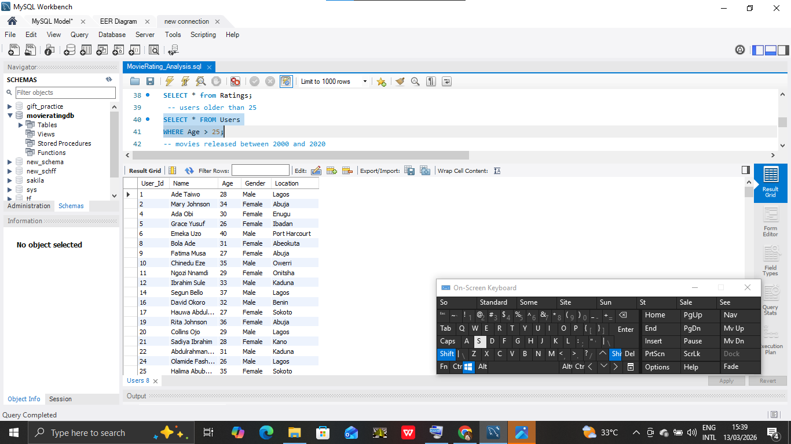
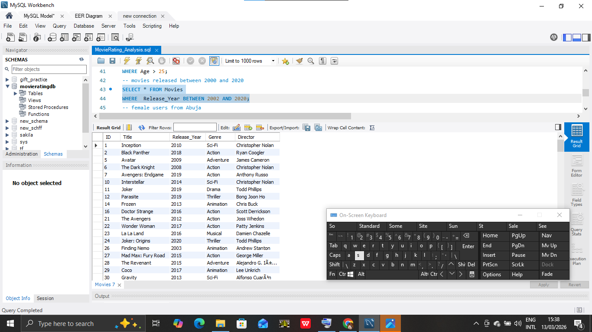
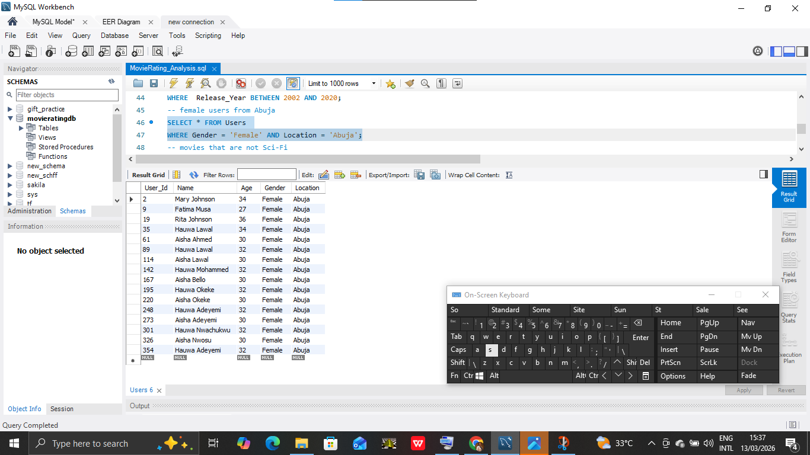
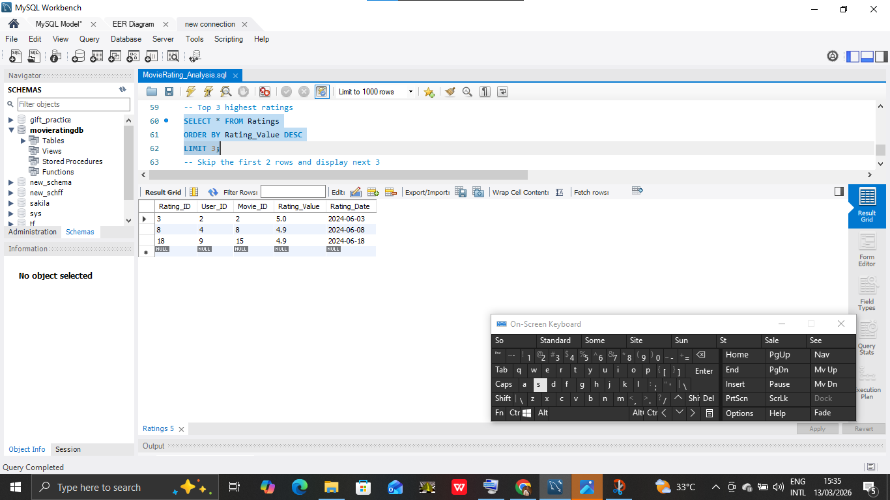

# Movie Rating Database System
A relational database project for managing movie ratings using MySQL.

## Project Overview
This project involves creating a relational database to manage movie ratings. It covers database schema design, data insertion, and complex querying using MySQL.

## Project Problem Statement
Entertainment companies often struggle to make data-driven decisions because their user and content data are trapped in separate, flat CSV files. This makes it impossible to answer critical business questions like:
* "Which genres are most popular among users in specific cities like Abuja or Lagos?"
* "How does movie age correlate with user satisfaction?"
* "Which target demographics are the most active reviewers?"

**The Solution:** A centralised MySQL database was designed and implemented to transform these disconnected files into a relational system, enabling fast, complex analysis of audience behaviour and content performance.

## Tools Used
* **Database:** MySQL
* **Editor:** MySQL Workbench
* **Data Source:** Google Sheets (CSV)

## 📊 Database Schema & ER Diagram
The system architecture uses a star-like schema to ensure data integrity and reduce redundancy. 
The database consists of three main tables:
* **Users Table:** Stores demographic details (Age, Gender, Location).
* **Movies Table:** Catalogue of films (Title, Release Year, Genre, Director).
* **Ratings Table:** A transactional bridge linking users to their movie experiences.


## Key Queries Performed
* Filtering users by age and location.
* Using logical operators to find specific movie genres.
* Sorting and pagination for data reporting.

## Implementation & Query Results
Below are the results of the business queries performed to extract insights.

### 1. Audience Segmentation (Users > 25)
**Goal:** Identify older demographics for targeted classic movie promotions.
```sql
SELECT * FROM Users WHERE age > 25;
```


### 2. Market Research (Female Users in Abuja)
**Goal:** Analyse the preferences of female users in the capital region.
```sql
SELECT * FROM Users WHERE gender = 'Female' AND location = 'Abuja';
```


### 3. Content Trends (Movies 2000-2020)
**Goal:** To evaluate the catalogue of modern-era films.
```sql
SELECT * FROM Movies WHERE release_year BETWEEN 2000 AND 2020;
```


### 4. Quality Control (High Ratings Analysis)
**Goal:** Identify the "Top 3" highest-rated experiences to understand success patterns.
```sql
SELECT * FROM Ratings ORDER BY rating_value DESC LIMIT 3;
```


## Technical Challenges & Solutions
* Date Formatting: During import, I encountered a Data truncated error for the Rating_Date column. I resolved this by importing dates as VARCHAR, then using STR_TO_DATE() to convert them into a standard MySQL DATE format.

* Referential Integrity: Enforced FOREIGN KEY constraints to ensure that every rating entry points to a valid User and Movie.
